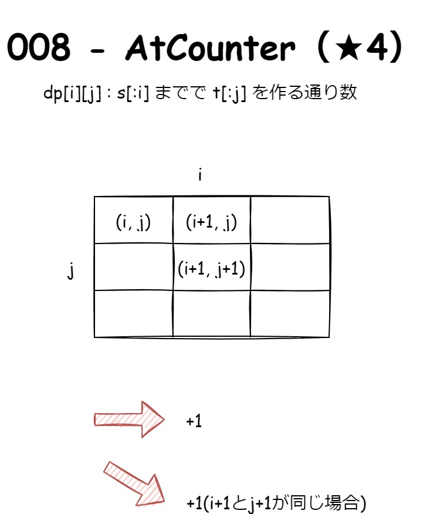
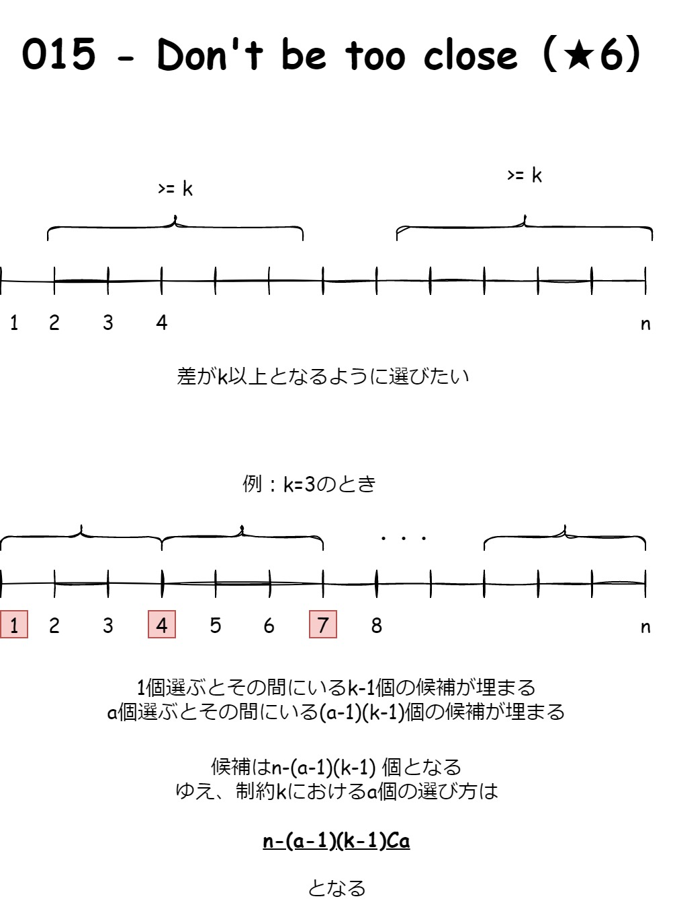
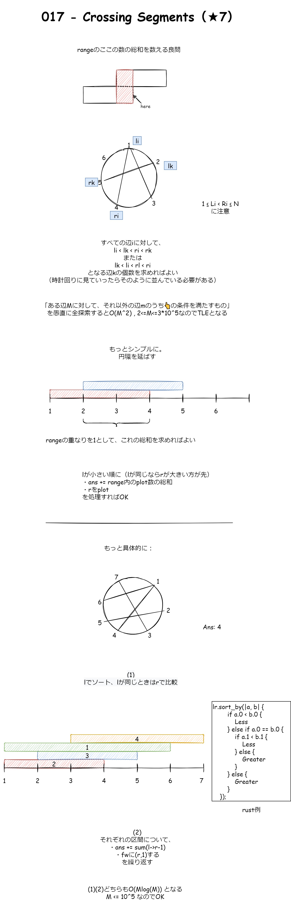
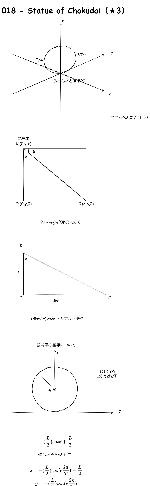
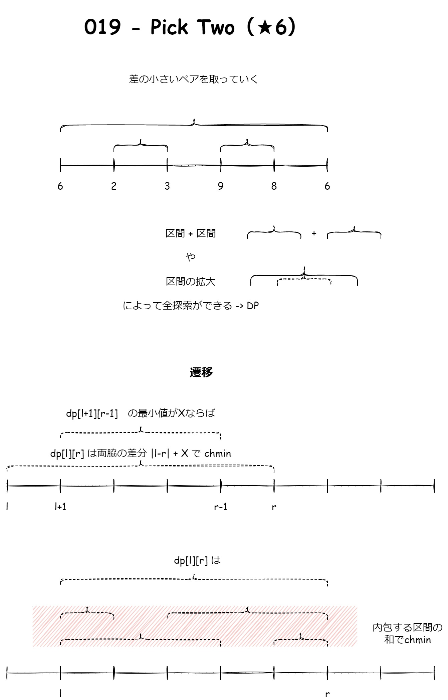
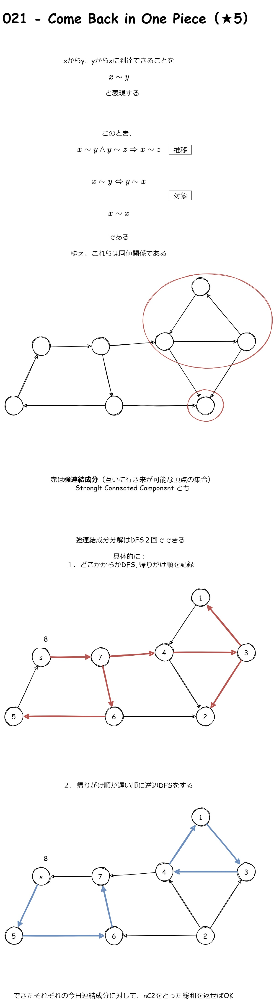

# https://atcoder.jp/contests/typical90

## links

1. [問題](https://atcoder.jp/contests/typical90/tasks/typical90_a) binary search
2. [問題](https://atcoder.jp/contests/typical90/tasks/typical90_b) bit全探索, zero padding
3. [問題](https://atcoder.jp/contests/typical90/tasks/typical90_c) bfs, 木の長さ
4. [問題](https://atcoder.jp/contests/typical90/tasks/typical90_d)
5. [問題](https://atcoder.jp/contests/typical90/tasks/typical90_e) 桁DP, doubling
6. [問題](https://atcoder.jp/contests/typical90/tasks/typical90_f) 辞書順, BinaryHeap
7. [問題](https://atcoder.jp/contests/typical90/tasks/typical90_g) binary search
8. [問題](https://atcoder.jp/contests/typical90/tasks/typical90_h) DP
9. [問題](https://atcoder.jp/contests/typical90/tasks/typical90_i) 偏角ソート, 尺取り法, 円環2倍
10. [問題](https://atcoder.jp/contests/typical90/tasks/typical90_j) 区間和
11. [問題](https://atcoder.jp/contests/typical90/tasks/typical90_k) DP, 区間スケジューリング
12. [問題](https://atcoder.jp/contests/typical90/tasks/typical90_l) Union Find
13. [問題](https://atcoder.jp/contests/typical90/tasks/typical90_m) Dijkstra
14. [問題](https://atcoder.jp/contests/typical90/tasks/typical90_n)
15. [問題](https://atcoder.jp/contests/typical90/tasks/typical90_o) [逆元nCr](https://blog.satoooh.com/entry/5195/) 区間を空けて選ぶ
16. [問題](https://atcoder.jp/contests/typical90/tasks/typical90_p) 全探索
17. [問題](https://atcoder.jp/contests/typical90/tasks/typical90_q) FenwickTree, range重なり
18. [問題](https://atcoder.jp/contests/typical90/tasks/typical90_r) 三角関数
19. [問題](https://atcoder.jp/contests/typical90/tasks/typical90_s) 区間DP
20. [問題](https://atcoder.jp/contests/typical90/tasks/typical90_t)
21. [問題](https://atcoder.jp/contests/typical90/tasks/typical90_u) 強連結成分分解(SCC)
22. [問題](https://atcoder.jp/contests/typical90/tasks/typical90_v)

## notes

