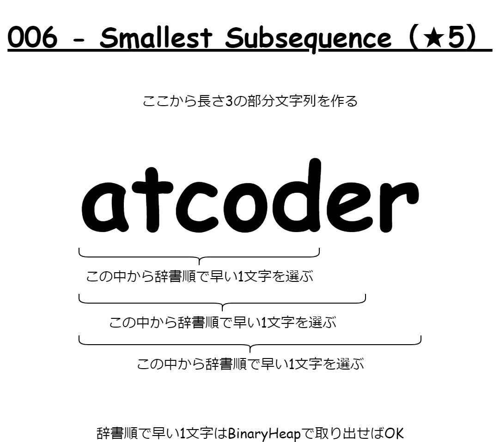

# https://atcoder.jp/contests/typical90

## links

1. https://atcoder.jp/contests/typical90/tasks/typical90_a binary search
2. https://atcoder.jp/contests/typical90/tasks/typical90_b bit brute-force, zero padding
3. https://atcoder.jp/contests/typical90/tasks/typical90_c bfs, tree length
4. https://atcoder.jp/contests/typical90/tasks/typical90_d
5. https://atcoder.jp/contests/typical90/tasks/typical90_e digit DP, doubling
6. https://atcoder.jp/contests/typical90/tasks/typical90_f Lexicographic order, BinaryHeap
7. https://atcoder.jp/contests/typical90/tasks/typical90_g binary search
8. https://atcoder.jp/contests/typical90/tasks/typical90_h DP
9. https://atcoder.jp/contests/typical90/tasks/typical90_i 偏角ソート, 尺取り法, 円環2倍
10. https://atcoder.jp/contests/typical90/tasks/typical90_j

## notes

